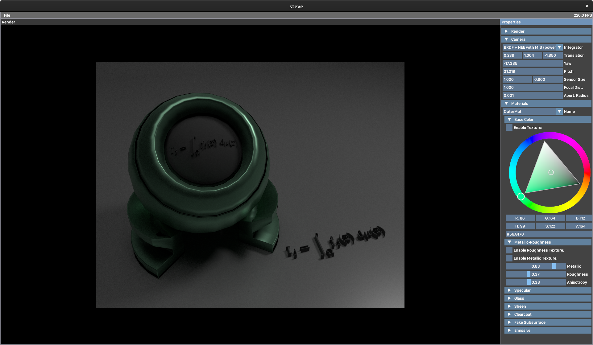

# steve - a pathtracer

**15-468 Final Project**



## About

Steve is a GPU-accelerated photorealistic rendering engine implementing a physically-based pathtracer with advanced sampling techniques. It leverages NVIDIA CUDA and OptiX for real-time ray tracing on modern GPUs, combined with ReSTIR (Restir importance sampling with spatial and temporal resampling) for variance reduction and improved image quality.

### Features

- **GPU Ray Tracing**: Powered by NVIDIA OptiX for efficient ray-triangle intersection and dynamic geometry
- **Physically-Based Rendering**: Disney BRDF material model with 15+ parameters for accurate material representation
- **Advanced Sampling**: ReSTIR temporal and spatial resampling for efficient direct lighting
- **Interactive Viewport**: Real-time camera control and parameter adjustment with ImGui
- **Multi-Format Support**: Load 3D models in OBJ and glTF/glTF binary formats
- **Deferred Shading**: G-buffer based rendering pipeline for geometry queries
- **Parallel Computing**: Multi-threaded CPU orchestration with Intel TBB

## Technology Stack

- **Languages**: C++20 (host), CUDA (device), GLSL (shaders)
- **GPU API**: NVIDIA CUDA 14 + OptiX ray tracing
- **Graphics**: OpenGL 3.3+ with GLAD + GLFW3
- **Build System**: CMake 3.25+ with Ninja
- **Package Management**: vcpkg
- **Key Libraries**:
  - OWL (OptiX Wrapper Library)
  - ImGui + ImGuizmo for UI
  - GLM for mathematics
  - spdlog for logging
  - nlohmann/json for scene configuration
  - RapidObj + TinyGLTF for model loading
  - STB Image for texture loading

## Building

### Prerequisites

- NVIDIA GPU with CUDA compute capability (e.g., RTX series)
- CUDA 14 compatible driver
- CMake 3.25 or higher
- C++ compiler with C++20 support (clang or g++)
- vcpkg installed and `VCPKG_ROOT` environment variable set

### Build Steps

1. **Set up vcpkg root** (if not already set):
   ```bash
   export VCPKG_ROOT=/path/to/vcpkg
   ```

2. **Generate build files**:
   ```bash
   cmake --preset vcpkg
   ```

3. **Build the project**:
   ```bash
   cmake --build build
   ```

The executable will be available at `build/src/app/steve`.

## Usage

Run the pathtracer with a scene configuration file:

```bash
./steve path/to/scene.json
```

The scene JSON file specifies:
- Camera position, field of view, and viewport settings
- 3D models to load (OBJ or glTF format)
- Materials and their parameters
- Light sources
- Rendering parameters (samples per pixel, max bounces, etc.)

### Interactive Controls

Once running, use the ImGui interface to:
- Adjust camera position and parameters in real-time
- Modify material properties
- Control rendering settings
- Export rendered frames

## Project Structure

```
steve/
├── include/
│   ├── app/              # Application and viewport
│   ├── pathtracer/
│   │   ├── host/         # CPU-side rendering orchestration
│   │   ├── device/       # GPU kernels (.cuh files)
│   │   └── shared/       # Shared CPU/GPU data structures
│   └── utils/            # OpenGL shader utilities
├── src/
│   ├── app/              # Application implementation
│   ├── pathtracer/
│   │   ├── host/         # CPU implementations
│   │   └── device/       # CUDA kernels (.cu files)
│   └── utils/            # Utility implementations
├── ext/                  # External dependencies (git submodules)
├── CMakeLists.txt
├── vcpkg.json
└── CMakePresets.json
```

## Rendering Pipeline

1. **G-buffer Pass**: Compute geometry information (positions, normals, motion vectors) for primary visibility
2. **Lighting Integration**: Path tracing with physically-based materials and multiple importance sampling
3. **ReSTIR Temporal**: Reuse importance samples across frames for improved convergence
4. **ReSTIR Spatial**: Share samples spatially within the current frame
5. **Compositing**: Tone mapping and display to screen

## Implementation Details

- **Ray Tracing**: OptiX-based GPU ray tracing with dynamic geometry support
- **Material System**: Evaluates Disney BRDF for 15+ material parameters per surface
- **Light Sampling**: Multiple importance sampling for direct and indirect lighting
- **Variance Reduction**: ReSTIR for efficient sample reuse and temporal coherence
- **Memory Management**: GPU memory handling via OptiX context and CUDA buffers
